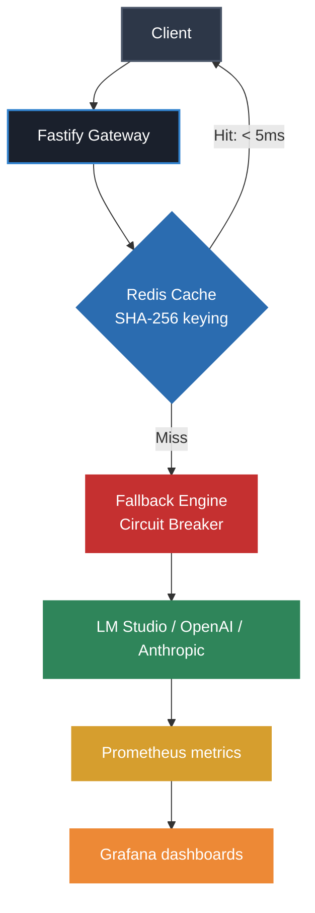

# LLM Inference Gateway

A production-grade AI gateway built with **Fastify** and **TypeScript** that routes requests across multiple LLM providers with intelligent fallback, Redis caching, and real-time observability.

> Built as a portfolio project to demonstrate backend engineering, distributed systems patterns, and AI infrastructure concepts.

---

## Architecture




### Design patterns used
- **Circuit Breaker** — providers are isolated; failures don't cascade
- **Cache-aside** — repeated prompts served in <5ms, zero model calls
- **Plugin architecture** — new providers implement one interface (`IProvider`)
- **Dependency inversion** — core logic never depends on concrete providers
- **Fail fast** — Zod validates all environment variables at startup

---

## Stack

| Layer | Technology |
|---|---|
| Runtime | Node.js 20 + TypeScript (strict) |
| HTTP framework | Fastify |
| Cache | Redis 7 via ioredis |
| Metrics | Prometheus + prom-client |
| Dashboards | Grafana |
| Infrastructure | Docker + Docker Compose |
| Validation | Zod |
| Logging | Pino (structured JSON) |

---

## Features

- **Multi-provider routing** — supports LM Studio, OpenAI-compatible APIs, extensible to any provider
- **Smart fallback** — automatic failover across providers with priority ordering
- **Circuit breaker** — opens after 3 consecutive failures, recovers after 30s
- **Redis caching** — SHA-256 prompt keying, configurable TTL, hit/miss tracking
- **Prometheus metrics** — latency histograms (p50/p95/p99), token usage, cache hit rate, provider health
- **Grafana dashboards** — real-time observability out of the box
- **Graceful shutdown** — SIGTERM/SIGINT handling, safe for Kubernetes
- **Structured logging** — Pino JSON logs with request correlation
- **Env validation** — Zod schema with hard fail on missing variables

---

## Getting started

### Prerequisites
- Node.js 20+
- pnpm
- Docker + Docker Compose
- LM Studio (or any OpenAI-compatible local model server)

### 1. Clone and install

```bash
git clone https://github.com/E3Deyy/llm-inference-gateway
cd llm-inference-gateway
pnpm install
```

### 2. Configure environment

```bash
cp .env.example .env
```

Edit `.env` with your values:

```env
PORT=3000
NODE_ENV=development
LMSTUDIO_BASE_URL=http://localhost:1234/v1
LMSTUDIO_MODEL=llama-3.2-3b-instruct OR whatever you want
REDIS_URL=redis://localhost:6379
CACHE_TTL_SECONDS=300
```

### 3. Start infrastructure

```bash
docker compose up -d
```

This starts Redis, Prometheus, and Grafana.

### 4. Start the gateway

```bash
pnpm dev
```

### 5. Test it

```bash
# Health check
curl http://localhost:3000/health

# Inference request
curl -X POST http://localhost:3000/v1/chat/completions \
  -H "Content-Type: application/json" \
  -d '{"messages":[{"role":"user","content":"What is an API gateway?"}]}'

# Second identical request — served from cache in <5ms
curl -X POST http://localhost:3000/v1/chat/completions \
  -H "Content-Type: application/json" \
  -d '{"messages":[{"role":"user","content":"What is an API gateway?"}]}'
```

---

## Observability

| Service | URL | Credentials |
|---|---|---|
| Gateway API | http://localhost:3000 | — |
| Prometheus | http://localhost:9090 | — |
| Grafana | http://localhost:3001 | admin / gateway123 |
| Metrics endpoint | http://localhost:3000/metrics | — |

### Key Prometheus metrics

```
gateway_requests_total          — requests by provider and status
gateway_request_duration_seconds — latency histogram (p50/p95/p99)
gateway_tokens_total            — token consumption by provider
gateway_cache_hits_total        — cache hits
gateway_cache_misses_total      — cache misses
gateway_provider_healthy        — provider health gauge (1/0)
```

---

## API Reference

### `POST /v1/chat/completions`

OpenAI-compatible inference endpoint.

**Request:**
```json
{
  "messages": [
    { "role": "user", "content": "Your prompt here" }
  ],
  "temperature": 0.7,
  "max_tokens": 1024,
  "provider": "lmstudio"
}
```

**Response:**
```json
{
  "id": "chatcmpl-abc123",
  "model": "llama-3.2-3b-instruct",
  "provider": "lmstudio",
  "latency_ms": 8323,
  "choices": [{
    "message": { "role": "assistant", "content": "..." },
    "finish_reason": "stop"
  }],
  "usage": {
    "prompt_tokens": 48,
    "completion_tokens": 60,
    "total_tokens": 108
  }
}
```

### `GET /health`

Returns gateway status, provider health, circuit breaker states, and cache statistics.

### `GET /metrics`

Prometheus scrape endpoint.

---

## Project structure

```
src/
├── config/        # Zod env validation
├── providers/     # IProvider interface + implementations
├── routing/       # Fallback engine + circuit breaker
├── cache/         # Redis client + cache service
├── metrics/       # Prometheus registry + metric definitions
├── services/      # InferenceService (orchestration)
└── routes/        # Fastify route handlers
infra/
├── prometheus.yml
└── grafana/
docker-compose.yml
```

---

## Adding a new provider

Implement the `IProvider` interface and register it:

```typescript
// src/providers/myprovider/myprovider.provider.ts
export class MyProvider implements IProvider {
  readonly name = 'myprovider'

  async execute(request: InferenceRequest): Promise<InferenceResponse> {
    // your implementation
  }

  async healthCheck(): Promise<ProviderHealth> {
    // your implementation
  }
}

// src/app.ts
providerRegistry.register(new MyProvider())
```

That's it. The router, fallback engine, and metrics pick it up automatically.

---

## Roadmap

- [ ] OpenAI + Anthropic providers
- [ ] Cost-based routing strategy (cheapest provider first)
- [ ] PostgreSQL analytics store
- [ ] BullMQ async job queue
- [ ] Kubernetes manifests + HPA
- [ ] OpenTelemetry distributed tracing
- [ ] Benchmarking suite (autocannon) or more
